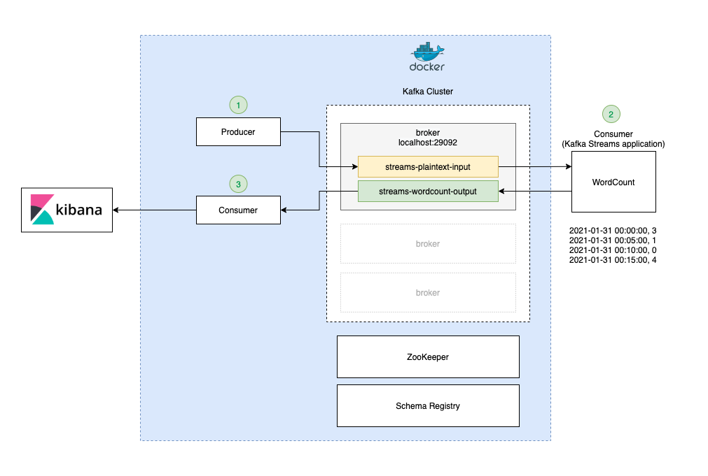

# 01. Real-Time Text Analytics

## Scenario
Customers need to send a text about "Harry Potter" into the system every 1 second then return how many of the `Harry`
words in every 5 seconds. If the input doesn't have words the system should return 0.

## Pipeline Architecture 


## Guildlines Steps
**Create Topic**
- Source `streams-plaintext-input`
```shell
bin/kafka-topics.sh --bootstrap-server localhost:29092 \
  --create --topic streams-plaintext-input
```

- Sink `streams-wordcount-output`
```shell
bin/kafka-topics.sh --bootstrap-server localhost:29092 \
  --create --topic streams-wordcount-output
```

**Producer**
```shell
bin/kafka-console-producer.sh --bootstrap-server localhost:29092 \
  --topic streams-plaintext-input
```

**Consume**
```shell
bin/kafka-console-consumer.sh --bootstrap-server localhost:29092 \
  --topic streams-wordcount-output \
  --from-beginning \
  --formatter kafka.tools.DefaultMessageFormatter \
  --property print.key=true \
  --property print.value=true \
  --property key.deserializer=org.apache.kafka.common.serialization.StringDeserializer \
  --property value.deserializer=org.apache.kafka.common.serialization.LongDeserializer
```
