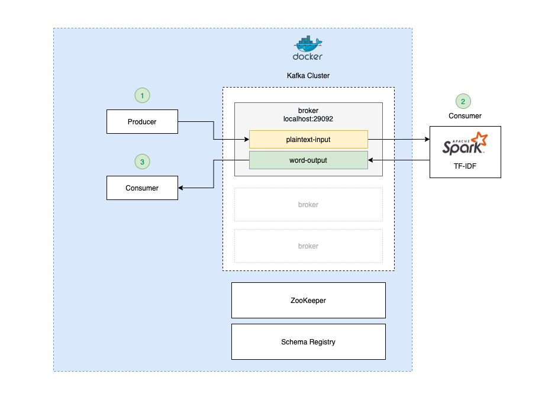

# 02. TF-IDF

TF-IDF (term frequency–inverse document frequency) is a numerical statistic that is intended to reflect how important 
a word is to a document in a collection or corpus.

## Pipeline Architecture

## Guideline Steps

**Create Topic**
- Source `plaintext-input`
```shell
kafka-topics.sh --bootstrap-server localhost:29092 \
  --create --topic plaintext-input
```

- Sink `word-output`
```shell
kafka-topics.sh --bootstrap-server localhost:29092 \
  --create --topic word-output
```
